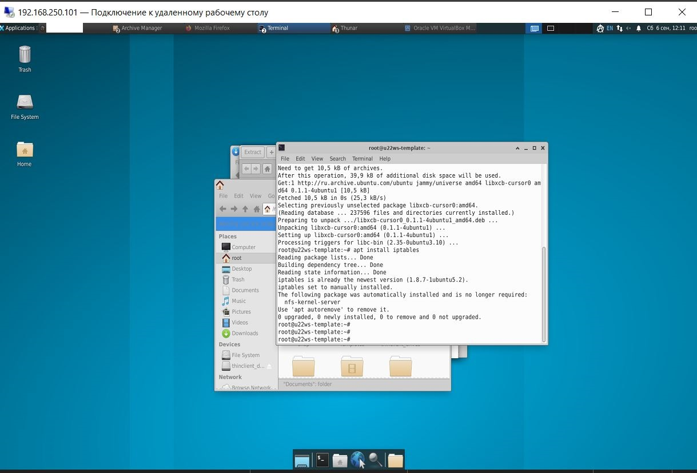

# ДЗ-18 Обновление ядра в базовой системе
#### Цель:  
Получить навыки работы с Git, Vagrant; 
Обновлять ядро в ОС Linux.

#### Стенд для выполнения домашнего задания
Vagrant будет установлен на виртуальную машину Proxmox VE.  
Операционная система виртуальной машины  Ubuntu 22.04  

Сначала проверяем, включена ли Nested Virtualization на хостовой машине:  
в параметре nested должно быть "Y"
```
root@pve4:~# cat /sys/module/kvm_intel/parameters/nested
Y
root@pve4:~# 
```
Если нет, то включаем:
```
root@pve4:~# echo "options kvm-intel nested=Y" > /etc/modprobe.d/kvm-intel.conf
root@pve4:~# modprobe -r kvm_intel
root@pve4:~# modprobe kvm_intel
```
Устанавливаем VM Ubuntu 22.04, Virtual Box, Vagrant

Проверяем версию Vagrant  
```
root@u22ws-template:~# VBoxManage --version
6.1.50_Ubuntur161033

root@u22ws-template:~# vagrant --version
Vagrant 2.4.1
root@u22ws-template:~# mkdir ~/vagrant-ubuntu
cd ~/vagrant-ubuntu

```

Попытки "подружить" Virtual Box с Nested Virtualization успеха не имели: 
при запуске виртуальной машины она неизменно приходила в состояние GuruMeditation :)
```
root@u22ws-template:~/vagrant-ubuntu# vagrant up Bringing machine 'default' up with 'virtualbox' provider... 
==> default: Checking if box 'ubuntu/jammy64' version '20241002.0.0' is up to date... 
==> default: Clearing any previously set forwarded ports... 
==> default: Clearing any previously set network interfaces... 
==> default: Preparing network interfaces based on configuration... default: Adapter 1: nat 
==> default: Forwarding ports... default: 22 (guest) => 2222 (host) (adapter 1) 
==> default: Running 'pre-boot' VM customizations... ==> default: Booting VM... 
==> default: Waiting for machine to boot. This may take a few minutes... 
The guest machine entered an invalid state while waiting for it to boot. Valid states are 'starting, running'. 
The machine is in the 'gurumeditation' state.
```
Не помогли ни выбор другой гостевой ОС, ни минимизация параметров VM...
Поиск по форумам выдал, что VBox нестабильно работает с вложенной виртуализацией.
Пришлось выбрать другой вариант:

### Vagrant + Libvirt на Ubuntu с обновлением ядра гостевой ОС
Очищаем неудачный проект  
```
root@u22ws-template:~/vagrant-ubuntu# vagrant destroy -f
==> default: Destroying VM and associated drives...
root@u22ws-template:~/vagrant-ubuntu# rm -rf .vagrant/
root@u22ws-template:~/vagrant-ubuntu# VBoxManage list vms
root@u22ws-template:~/vagrant-ubuntu# 
```

#### 1. Установка зависимостей

Сначала обновляем индексы пакетов и устанавливаем необходимые пакеты:

```
root@u22ws-template:~# apt update
Hit:1 http://ru.archive.ubuntu.com/ubuntu jammy InRelease
Hit:2 http://ru.archive.ubuntu.com/ubuntu jammy-updates InRelease
Hit:3 http://ru.archive.ubuntu.com/ubuntu jammy-backports InRelease
Hit:4 http://security.ubuntu.com/ubuntu jammy-security InRelease
Reading package lists... Done


root@u22ws-template:~# apt install -y \
  qemu-kvm \
  libvirt-daemon-system \
  libvirt-clients \
  bridge-utils \
  virt-manager \
  vagrant \
  vagrant-libvirt
```

Проверяем, что сервис libvirtd запущен:
```
systemctl status libvirtd
```
Добавляем текущего пользователя в группу libvirt, чтобы можно было запускать Vagrant без root:
```
sudo usermod -aG libvirt $USER
newgrp libvirt
```
2. Создание проекта Vagrant

Создаём директорию проекта и переходим в неё:
```
mkdir vagrant-ubuntu && cd vagrant-ubuntu
```
В корне проекта создаём файл Vagrantfile со следующим содержимым:
```
Vagrant.configure("2") do |config|
  config.vm.box = "generic/ubuntu2204"

  config.vm.provider :libvirt do |libvirt|
    libvirt.memory = 2048
    libvirt.cpus = 2
  end

  config.vm.network "forwarded_port", guest: 22, host: 2222, id: "ssh"
end
```
Запускаем виртуальную машину:
```
root@u22ws-template:~/vagrant-ubuntu# vagrant up --provider=libvirt

root@u22ws-template:~/vagrant-ubuntu# vagrant status
Current machine states:

default                   running (libvirt)

The Libvirt domain is running. To stop this machine, you can run
`vagrant halt`. To destroy the machine, you can run `vagrant destroy`.
root@u22ws-template:~/vagrant-ubuntu#

```
Подключаемся к гостевой ОС:
```
root@u22ws-template:~/vagrant-ubuntu# vagrant ssh
Last login: Fri Sep  5 16:44:13 2025 from 192.168.121.1
vagrant@ubuntu2204:~$ ip a | grep inet | grep -v intet6
    inet 127.0.0.1/8 scope host lo
    inet 192.168.121.11/24 metric 100 brd 192.168.121.255 scope global dynamic eth0
    inet6 fe80::5054:ff:fe0c:814b/64 scope link
vagrant@ubuntu2204:~$


```
3. Обновление ядра в гостевой ОС (Ubuntu 22.04)

После входа в виртуальную машину выполняем обновление ядра.

Обновляем пакеты:
```
vagrant@ubuntu2204:~$ apt update && apt upgrade -y
Hit:1 https://mirrors.edge.kernel.org/ubuntu jammy InRelease
Get:2 https://mirrors.edge.kernel.org/ubuntu jammy-updates InRelease [128 kB]
Get:3 https://mirrors.edge.kernel.org/ubuntu jammy-backports InRelease [127 kB]
Get:4 https://mirrors.edge.kernel.org/ubuntu jammy-security InRelease [129 kB]
Fetched 384 kB in 9s (44.1 kB/s)
...

```
Устанавливаем HWE ядро:
```
vagrant@ubuntu2204:~$ sudo apt install --install-recommends linux-generic-hwe-22.04 -y
Reading package lists... Done
Building dependency tree... Done
Reading state information... Done
...

```
Обновляем конфигурацию загрузчика (необязательно, но лучше подстраховаться):
```
vagrant@ubuntu2204:~$ sudo update-grub
Sourcing file `/etc/default/grub'
Sourcing file `/etc/default/grub.d/init-select.cfg'
Generating grub configuration file ...
Found linux image: /boot/vmlinuz-6.8.0-79-generic
Found initrd image: /boot/initrd.img-6.8.0-79-generic
Found linux image: /boot/vmlinuz-5.15.0-153-generic
Found initrd image: /boot/initrd.img-5.15.0-153-generic
Found linux image: /boot/vmlinuz-5.15.0-91-generic
Found initrd image: /boot/initrd.img-5.15.0-91-generic
Warning: os-prober will not be executed to detect other bootable partitions.
Systems on them will not be added to the GRUB boot configuration.
Check GRUB_DISABLE_OS_PROBER documentation entry.
done
vagrant@ubuntu2204:~$

```
Перезагружаем машину:
```
sudo reboot
```
После перезагрузки проверяем версию ядра:
```
vagrant@ubuntu2204:~$ uname -r
6.8.0-79-generic
vagrant@ubuntu2204:~$
```
#### Ядро обновлено с версии 5.15.0-91 до 6.8.0-79
## Домашнее задание выполнено
